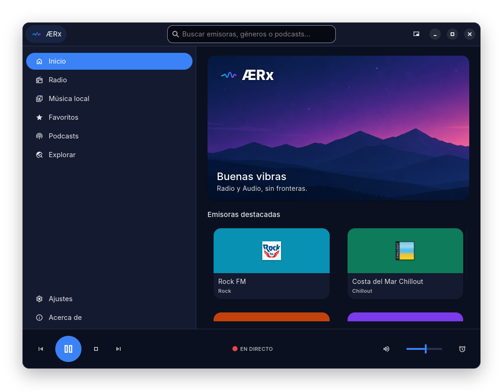
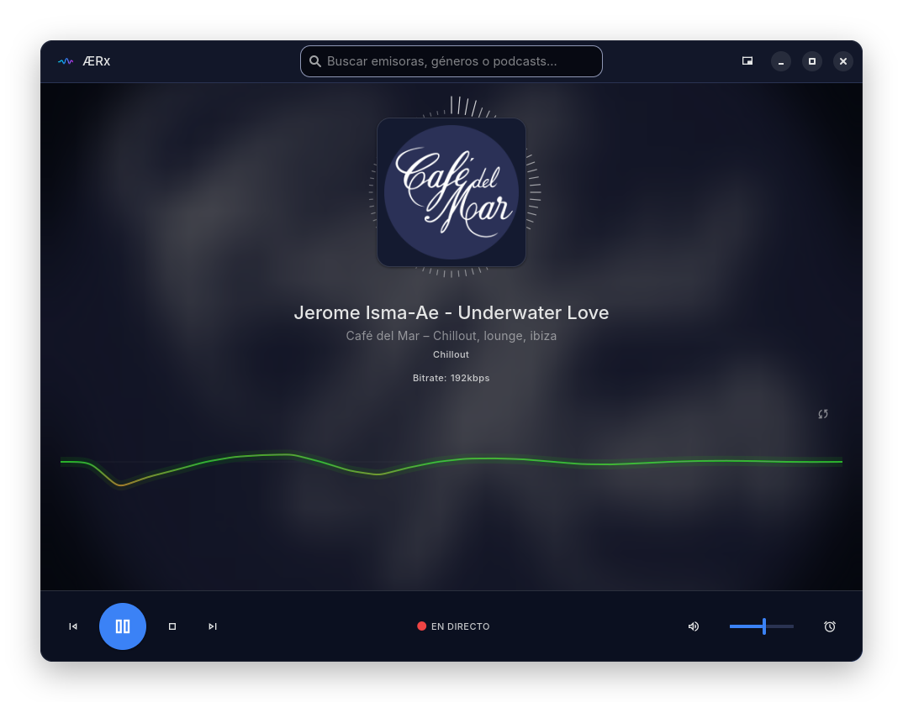
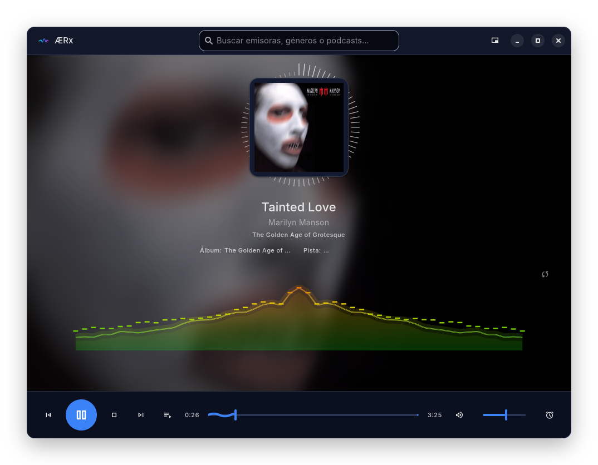
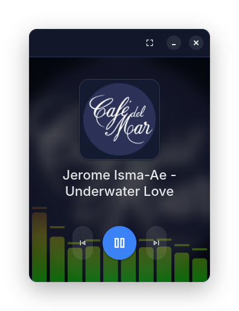

<h1 align="center">
  <picture>
    <source media="(prefers-color-scheme: dark)" srcset="assets/branding/aerx-player-logo.svg">
    <source media="(prefers-color-scheme: light)" srcset="assets/branding/aerx-player-logo-light.svg">
    
  </picture>
</h1>

<p align="center">
  <a href="LICENSE"></a>
  <a href="../../releases"></a>
  <a href="../../actions/workflows/build-release.yml"></a>
  <a href="../../releases"></a>
  <a href="../../commits/main"></a>
  
  
</p>

<p align="center"><strong>Radio y Audio, sin fronteras.</strong></p>

**ÆRx Player** es una aplicación de escritorio para **distribuciones basadas en Debian/Ubuntu** (Ubuntu 22.04+, Linux Mint 21+, Debian 12+) que permite escuchar emisoras de radio españolas en directo, seguir podcasts y reproducir archivos de audio locales, con una interfaz Material Design 3 integrada en el escritorio GNOME/Adwaita.

> Anteriormente publicada como **RadioES**, el proyecto se relanza bajo la marca **ÆRx Player** junto con un rediseño Material Design 3 y soporte de podcasts.

---

## Características

- **Podcasts** — búsqueda vía iTunes Search API, suscripción por feed RSS y descarga de episodios.
- **+20 emisoras preconfiguradas** — RNE 1/2/3/4/5, Cadena SER, Cadena 100, Rock FM, Los 40, Europa FM, Cadena Dial, COPE, Onda Cero, Megastar FM, Kiss FM, Radio 3, Café del Mar y más.
- **Descubrimiento de emisoras** vía [Radio Browser API](https://www.radio-browser.info/) (búsqueda en tiempo real).
- **Reproductor de archivos de audio** — MP3, FLAC, OGG, M4A, AAC, WAV, OPUS.
- **Edición de etiquetas ID3/FLAC/MP4** — título, artista, álbum, nº de pista y carátula, con guardado directo en el fichero.
- **Búsqueda automática de carátula e info** vía MusicBrainz + Cover Art Archive, con iTunes Search API como respaldo.
- **Interfaz Material Design 3** — paleta de color por tonos (claro/oscuro reactivo), indicadores de progreso "wavy" e iconografía Material Symbols.
- **22 esquemas de color** — Dracula, Nord, Catppuccin, Gruvbox, Solarized, Monokai, Ayu, Tokyo Night, Kanagawa, Rosé Pine y más, seleccionables desde Ajustes.
- **Modo mini-reproductor** — vista compacta con carátula, fondo desenfocado/sólido, título y transporte, redimensionando la ventana; ideal para dejarlo de fondo mientras trabajas.
- **Fondo de carátula a pantalla completa** con difuminado y oscurecido al ocultar el panel lateral, si la carátula tiene buena resolución.
- **Comprobación de actualizaciones** desde "Acerca de", con enlace directo de descarga del `.deb` cuando hay una versión más reciente en GitHub.
- **Visualizador de espectro multi-modo** — 9 estilos: Gauss, barras agrupadas, osciloscopio (por defecto), barras clásicas, espectrograma, radial, espejo, vúmetro y partículas. Además, un anillo ambiental monocromo siempre visible alrededor de la carátula.
- **Secciones colapsables por género** con sección de Favoritas.
- **Añadir emisoras manualmente** por URL; exportar/importar favoritos en JSON.
- **Ordenar lista MP3** por nombre, título, artista o álbum.
- **Sleep timer** configurable (15/30/60/90 min).
- **Notificaciones de escritorio** al cambiar la canción en radio.
- **Caché persistente** de la lista MP3 y carpeta de música configurable con escaneo recursivo.
- **Interfaz responsiva** con panel lateral adaptable (`Adw.OverlaySplitView`).
- **Atajos de teclado** — `Espacio` play/pause · `←/→` anterior/siguiente · `M` silenciar.

---

## Interfaz

<p align="center">
  
  <br><sub>Inicio — emisoras destacadas</sub>
</p>

<p align="center">
  
  <br><sub>Radio en directo — visualizador y anillo ambiental</sub>
</p>

<p align="center">
  
  <br><sub>Música local — fondo de carátula a pantalla completa</sub>
</p>

<p align="center">
  
  <br><sub>Modo mini-reproductor</sub>
</p>

---

## Instalación (Debian/Ubuntu)

### Opción 1 — Paquete `.deb` (recomendado)

Descarga el último `.deb` desde la sección [Releases](../../releases/latest) e instálalo con:

```bash
sudo apt install ./aerx-player_1.0_all.deb
```

Esto instala todas las dependencias automáticamente. Después busca **ÆRx Player** en el lanzador de aplicaciones o ejecuta `aerx` en la terminal.

Para desinstalar:

```bash
sudo apt remove aerx-player
```

### Opción 2 — Ejecutar desde el código fuente

**Requisitos previos:**

```bash
sudo apt install \
    python3-gi python3-gi-cairo \
    gir1.2-gtk-4.0 gir1.2-adw-1 \
    gir1.2-gstreamer-1.0 gir1.2-gst-plugins-base-1.0 \
    gir1.2-gdkpixbuf-2.0 \
    gstreamer1.0-plugins-base gstreamer1.0-plugins-good \
    gstreamer1.0-plugins-bad gstreamer1.0-plugins-ugly \
    gstreamer1.0-libav \
    fonts-inter
pip3 install --user mutagen requests
```

**Lanzar:**

```bash
git clone https://github.com/fredycibersec/aerx-player.git
cd aerx-player
python3 main.py
# o bien:
bash install.sh   # instala iconos y .desktop para el lanzador
bin/aerx
```

---

## Compilar el paquete `.deb`

Requiere `dpkg-dev`:

```bash
sudo apt install dpkg-dev
bash build-deb.sh
# El paquete se genera en dist/aerx-player_<versión>_all.deb
```

El workflow de CI/CD en `.github/workflows/build-release.yml` construye y publica el `.deb` automáticamente cuando se crea un tag `v*`.

---

## Dependencias del sistema

| Paquete                          | Motivo                         |
|----------------------------------|-------------------------------|
| `python3-gi`, `python3-gi-cairo` | Bindings GTK/GObject           |
| `gir1.2-gtk-4.0`                 | GTK 4                          |
| `gir1.2-adw-1`                   | libadwaita (diseño GNOME HIG)  |
| `gir1.2-gstreamer-1.0`           | GStreamer (reproducción audio) |
| `gstreamer1.0-plugins-*`         | Codecs MP3, AAC, Vorbis, etc.  |
| `python3-requests` *(o pip)*     | Descarga de emisoras/logos/podcasts |
| `python3-mutagen` *(opcional)*   | Lectura de metadatos MP3/FLAC  |
| `python3-defusedxml` *(opcional)* | Parseo seguro de feeds RSS de podcasts |

---

## Estructura del proyecto

```
aerx-player/
├── main.py              # Ventana principal, UI GTK4/Adwaita
├── player.py            # Reproductor GStreamer con soporte ICY
├── radio_browser.py     # Cliente API Radio Browser
├── podcasts.py          # Búsqueda, RSS y descarga de podcasts
├── metadata.py          # Lectura de etiquetas ID3/FLAC/MP4
├── cover_lookup.py       # Búsqueda automática de carátula (MusicBrainz/iTunes)
├── update_check.py      # Comprobación de nuevas versiones vía GitHub Releases
├── bin/aerx              # Lanzador de shell
├── assets/branding/      # Logo, símbolo e icono de marca (SVG)
├── data/
│   ├── icons/            # Tema de iconos hicolor (16–512 px) y símbolo de marca
│   ├── style-m3-*.css    # Estilos Material Design 3
│   └── spanish_stations.json   # Emisoras preconfiguradas
├── aerx-player.desktop   # Entrada del lanzador de aplicaciones
├── build-deb.sh          # Script para generar el .deb
├── install.sh            # Instalador para ejecutar desde fuente
└── dist/                 # Paquetes .deb generados
```

---

## Versiones

| Versión     | Cambios destacados |
|-------------|-------------------|
| 1.01        | Cambios menores. El audio se identifica ante PipeWire/PulseAudio como **ÆRx Player** (antes "python3"), con volumen y silencio propios en el mezclador del sistema en vez de compartirlos con otros programas Python. Capturas de pantalla del README recortadas al borde de la ventana. |
| 1.0         | **Primera versión estable.** Modo mini-reproductor (carátula, fondo desenfocado/sólido, transporte, ventana redimensionada). Espectrograma frecuencia/tiempo y anillo ambiental monocromo alrededor de la carátula, nuevos en el visualizador. Osciloscopio como visualización por defecto. Slider de volumen rediseñado (línea recta, mismo grosor que el indicador de progreso). Corrige el desfase del espectrograma respecto al audio, la carátula del mini-reproductor para emisoras de radio, y anterior/siguiente en modo mini. |
| 0.99-beta3  | **Esquemas de color** — nuevo selector en Ajustes con 22 paletas completas de temas de editor/terminal conocidos (Dracula, Nord, Catppuccin, Gruvbox, Solarized, Monokai, Ayu, Tokyo Night, Kanagawa, Rosé Pine y más), además del ÆRx por defecto. Hedge de compatibilidad CSS para libadwaita 1.6+/GTK 4.16+ (custom properties `var(--nombre)` junto a `@define-color`), confirmado en Ubuntu 26.04.1. |
| 0.99-beta2  | Corrige el `.deb`: faltaban `hero-banner.png` y `icons/aerx-mark.svg` en el paquete, por lo que el banner y el logo no se veían tras instalar en otra máquina. |
| 0.99-beta   | **Relanzamiento como ÆRx Player** (antes RadioES): nueva identidad de marca e iconografía, soporte de **podcasts** (búsqueda, suscripción y descarga de episodios), y últimos ajustes de estilo Material Design 3 en los controles de reproducción. Última beta antes de la **1.0**. |

---

## Compatibilidad

| Distribución             | Estado     |
|--------------------------|-----------|
| Ubuntu 26.04.1 LTS       | ✅ Probado |
| Ubuntu 24.04 LTS         | ✅ Probado |
| Ubuntu 22.04 LTS         | ✅ Probado |
| Linux Mint 21+           | ✅ Probado |
| Debian 12 (Bookworm)     | ✅ Probado |
| Pop!_OS 22.04            | ✅ Compatible |
| Otras distros Debian/Ubuntu | ⚠️ Sin probar |

> **Nota:** requiere GTK 4.6+ y libadwaita 1.x. En distros más antiguas (Ubuntu 20.04, Debian 11) la versión de GTK del sistema es insuficiente.

---

## Contribuir

¡Los reportes de fallos, ideas y pull requests son bienvenidos!

- **Reportar un fallo:** abre un [issue de bug](../../issues/new?template=bug_report.yml) — la plantilla te pedirá versión, distro y pasos para reproducirlo.
- **Proponer una idea:** abre un [issue de mejora](../../issues/new?template=feature_request.yml) describiendo el problema que resuelve y la solución propuesta.
- **Vulnerabilidades de seguridad:** **no** uses un issue público — sigue el proceso descrito en [SECURITY.md](SECURITY.md).
- **Pull requests:** haz un fork del repositorio, crea una rama descriptiva (`fix/...`, `feat/...`) y abre el PR contra `main` (la plantilla te guía sobre qué incluir). Para cambios grandes, abre antes un issue para discutir el enfoque.
- **Entorno de desarrollo:** sigue la [Opción 2 de instalación](#opción-2--ejecutar-desde-el-código-fuente) para ejecutar la app desde el código fuente y probar tus cambios con `python3 main.py`.
- **Estilo:** mantén la consistencia con el resto del código (nombres en español para UI/comentarios de dominio, PEP 8 razonable) y evita añadir dependencias nuevas sin justificarlo en el PR.

---

## Agradecimientos

- [Radio Browser](https://www.radio-browser.info/) — API de descubrimiento de emisoras de radio.
- [MusicBrainz](https://musicbrainz.org/) y [Cover Art Archive](https://coverartarchive.org/) — metadatos y carátulas de álbumes.
- [iTunes Search API](https://developer.apple.com/library/archive/documentation/AudioVideo/Conceptual/iTuneSearchAPI/) — respaldo de carátulas y búsqueda de podcasts.
- [Material Symbols](https://fonts.google.com/icons) (Google) — iconografía de la interfaz.
- GNOME, GTK4 y libadwaita — toolkit e integración de escritorio.

---

## Licencia

GPL-3.0 © 2026 [SaruMan](mailto:sarumanthegrey@proton.me)

---

<p align="center">
  <a href="https://ko-fi.com/V7D726PG7M"></a>
</p>
